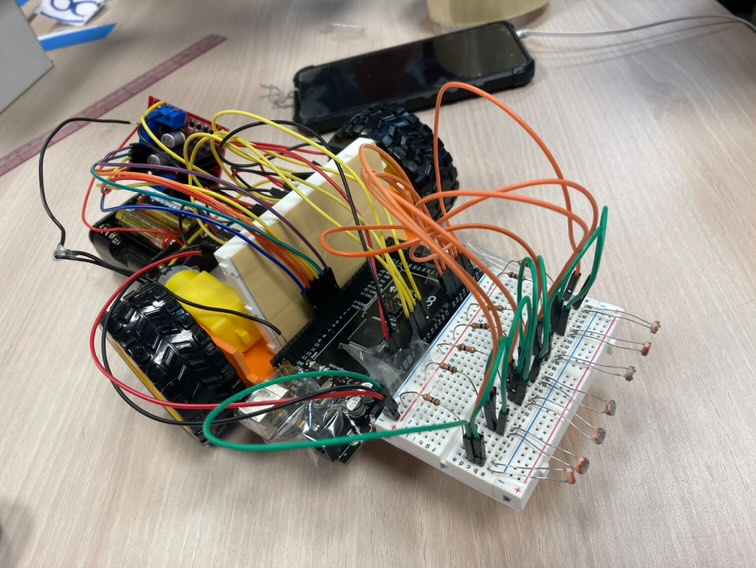
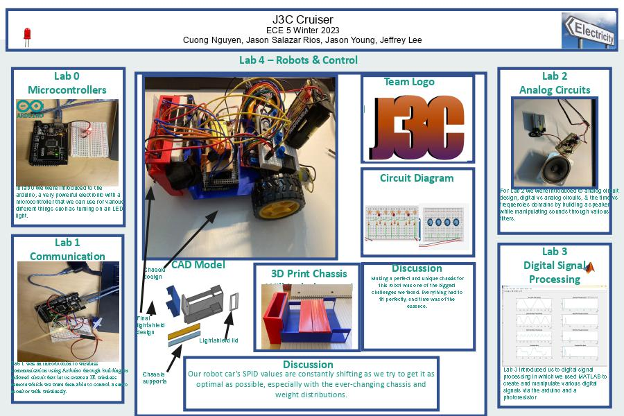
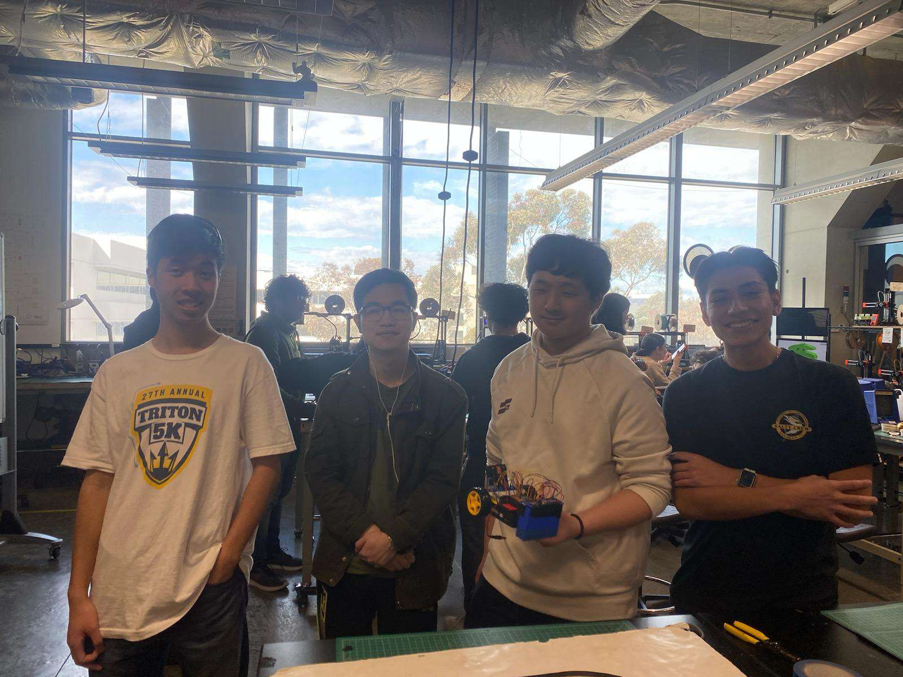

  <h1>ECE 5 Line Following Robot Website</h1>
  <h3>Team 4 - J3C: Cuong Nguyen, Jason Salazar Rios, Jason Young, Jeffrey Lee</h3>

---
## Challenges 1-2: Prototyping/Assembly

## Challenge 3: Robot Following Line
<iframe id="video" width="560" height="315" src="https://www.youtube.com/embed/TpEJcigBHBk/" frameborder="0" allow="autoplay; encrypted-media" allowfullscreen=""></iframe>

## Final Competition Robot

## Explanation of PID Control:
Throughout the competition, we adjusted PID values according to the track, situation, and any observed behaviors. We adjusted them based on the following:
* Higher P for faster turn speed and reaction (better reaction time that consequently results in some overshoot)
* Higher I for a more steady following of the line (the ability to keep track of previous allows elimination of small errors and for more consistent turning in similar turns)
* Higher D to compensate for overshoot and gives the robot predictive behavior of error to turn ahead of sharper turns
Keeping this in mind, we adjusted PID accordingly to the tracks:
* Loop Track:
  * Higher Speed to fulfill as many turns as possible in the given time
  * Medium P value to lower rise time and speed up reaction so that turns in the loop can be completed in time (while minimizing overshoot)
  * Small I value since it may allow for more consistent behavior when following the straighter lines and repeating turns, but not too large to contribute significantly to overshoot and stability
  * Small to Medium D values since turns in the loop may be somewhat sharp, we want to make sure that our robot is able to make those turns in time
* Frequency Sweep Track:
  *  Lower Speed to not overshoot the turns too much and to allow the robot to have enough time to adjust to the sharper turns
  *  Low to Medium P value to make sure the robot makes the turn in time but to reduce the chance of overshoot and running off the track
  *  No I value since the track has too many varying changes, we didn't want to add any additional chance of overshoot and accounting for steady-state error was not as necessary
  *  Medium to High D value to make sure that the robot makes the turn in time as it would help with the sharper turns and adjust turning speed ahead of time before turns
* Drag Race Track:
  * Highest Speed Value since there were few turns and it was a relatively straight track, we just needed our robot to go as fast as possible
  * Medium to High P values to increase reaction time to any slight turns along the track, however we didn't want it so much that a slight curve may cause overshoot
  * Medium I values since the track was mostly straight, we wanted to focus on adjusting slight errors rather than larger ones and keep the Robot running steadily on the track
  * Low D values, while we wanted to account for overshoot, since no sharp turns were being made we didn't need to have values for D to be too high   

## Code Modifications:
We modified the code so that the base speed. Some attempts were made to modify the code to have more precise calibration of black and white lines and to also reduce the risk of misreading shadows and following those readings.

## Poster:

## Competition Scores and Rankings for each Track:
* Drag Race
  * Time: 18.41 seconds
  * Rank: Lost early in losing bracket (Competed in 2 rounds and lost in both)
* Freq Sweep
  * Distance: 8
  * Time: 14.3 seconds
  * Rank: Lower Ranking (Somewhat decent distance but only reaching the next stop after passing)
* Loop:
  * Number of Loops: 2
  * Rank: Bottom Ranking (Passing number of loops)

## Videos From Competition!
<iframe id="video" width="560" height="315" src="https://www.youtube.com/embed/" frameborder="0" allow="autoplay; encrypted-media" allowfullscreen=""></iframe>

## Team Picture From Competition Day!

## Improvements Made and Ones We Wish to Make / Didn't Have Time to Make
In the last week, we optimized our chassis by printing one that would allow for more organized placement of our components and allow our photoresistors to read closer to the ground. As a result, our final competition robot was able to get better and more consistent calibrations and readings. We also were able to make it more convenient to make changes to our robot and to adjust PID values. We also made sure to make some tests for PID values to better optimize them for different tracks. Unfortunately in our last week, as we moved to the new chassis we found that our motors and wheels were failing to work properly (In one iteration the wheel couldn't connect properly and in the next, the motors would react inconsistently on their own). In our last attempt, we were able to get better motors attached but had little time to diagnose for errors and bugs and thus, ended up with a disappointing result despite all of our efforts. We wish to have improved the robot to move smoother and faster by optimizing the weight and PID values and fixing any errors, unfortunately, we ran out of time but still managed to build a functioning robot even if it wasn't to our expectations.
